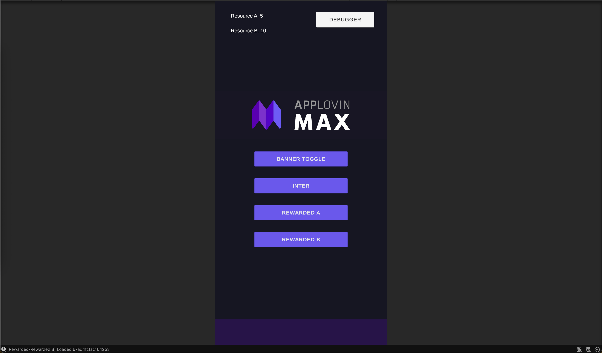

# AppLovin MAX Unity Demo

A Unity sample project demonstrating a clean, maintainable integration of **AppLovin MAX** for showing ads:
- Banner ads
- Interstitial ads
- Two separate Rewarded ad units

The project implements **all listener and delegate methods** for each ad type — even if only for logging — so you can clearly see the lifecycle of ads and how to hook into them.

This project and documentation can be extended upon request. New features like Zenject demonstration, automated android version and similar useful implementation can be added.

---

## Features

### Ad Types Implemented
- **Banner** – Toggle on/off, positioned via settings.
- **Interstitial** – Fullscreen ad between content.
- **Rewarded A & Rewarded B** – Two separate reward scenarios for testing.

### Listener Coverage

All relevant MAX callbacks are implemented and logged:

- **SDK**
  - `OnSdkInitializedEvent`
- **Banner**
  - `OnAdLoadedEvent`
  - `OnAdLoadFailedEvent`
  - `OnAdClickedEvent`
  - `OnAdExpandedEvent`
  - `OnAdCollapsedEvent`
  - `OnAdRevenuePaidEvent`
- **Interstitial**
  - `OnAdLoadedEvent`
  - `OnAdLoadFailedEvent`
  - `OnAdDisplayedEvent`
  - `OnAdDisplayFailedEvent`
  - `OnAdClickedEvent`
  - `OnAdHiddenEvent`
  - `OnAdRevenuePaidEvent`
- **Rewarded**
  - `OnAdLoadedEvent`
  - `OnAdLoadFailedEvent`
  - `OnAdDisplayedEvent`
  - `OnAdDisplayFailedEvent`
  - `OnAdClickedEvent`
  - `OnAdHiddenEvent`
  - `OnAdReceivedRewardEvent`
  - `OnAdRevenuePaidEvent`

---

## Project Structure and Script Descriptions

### Scripts/Max/

*  **[MaxInitializer.cs](Assets/Scripts/Max/MaxInitializer.cs)**

    - Initializes the MAX SDK once at app start and survives scene loads (DontDestroyOnLoad).
    - Optional switches for verbose logging and test device IDs (must be set before InitializeSdk).
    - Subscribes to MaxSdkCallbacks.OnSdkInitializedEvent and is the single place to kick off ad loading via MaxAdsService.
    - Editor-safe: can expose a helper to open the Mediation Debugger on device.
    - Common pitfalls it prevents: calling load/show before the SDK is initialized.

*  **[MaxAdService.cs](Assets/Scripts/Max/MaxAdService.cs)**

    - A small facade singleton that owns all ad controllers and exposes a tiny UI API:
        - ToggleBanner(), 
        - ShowInterstitial(), 
        - ShowRewardedA(), 
        - ShowRewardedB().

    - Accepts a MaxAdSettings asset (ScriptableObject) so no IDs are hard-coded.
    - Subscribes once and guards against double registration (e.g., scene reloads).
    - Raises a simple ready signal after MAX init so UI can wire listeners safely.
    - Ideal place to later route impression revenue to analytics/MMPs (kept out of controllers).

*  **[BannerAdController.cs](Assets/Scripts/Max/BannerAdController.cs)**
    
    - Creates/configures a banner via AdViewConfiguration (position + background color).
    - Handles load/show/hide/toggle and logs all supported banner callbacks:
        - OnAdLoaded, 
        - OnAdLoadFailed, 
        - OnAdClicked, 
        - OnAdExpanded, 
        - OnAdCollapsed, 
        - OnAdRevenuePaid.

*  **[InterstitialAdController.cs](Assets/Scripts/Max/InterstitialAdController.cs)**

    - Manages full-screen interstitials: preload → show → preload next.
    - Implements exponential backoff retry on load failures (1–64s).
    
    - Logs all interstitial callbacks:
        - OnAdLoaded, 
        - OnAdLoadFailed, 
        - OnAdDisplayed, 
        - OnAdDisplayFailed, 
        - OnAdClicked, 
        - OnAdHidden, 
        - OnAdRevenuePaid.
    - Public API: 
        - Initialize(adUnitId), 
        - Preload(), 
        - Show().

* **[RewardedAdController.cs](Assets/Scripts/Max/RewardedAdController.cs)**

    - Same lifecycle as interstitials, plus the reward flow.
        - Logs all rewarded callbacks:
            - OnAdLoaded, 
            - OnAdLoadFailed, 
            - OnAdDisplayed, 
            - OnAdDisplayFailed, 
            - OnAdClicked, 
            - OnAdHidden, 
            - OnAdReceivedReward, 
            - OnAdRevenuePaid.

    - Exposes **OnRewardGranted** event so game code (e.g., “skip question”, coins) can react without touching ad logic.
    - Instantiated twice by MaxAdsService for Rewarded A and Rewarded B ad units.

### Scripts/Configs/

* **[MaxAdSettings.cs](Assets/Scripts/Config/MaxAdSettings.cs)**

    - ScriptableObject that centralizes ad configuration:

    - Android Ad Unit IDs: 
        - Banner, 
        - Interstitial, 
        - Rewarded A and Rewarded B
    - Banner position and background color
    - Whether the banner starts hidden
    - Create multiple assets (e.g., Dev, Staging, Prod) and swap them without changing code.

### Scripts/UI/

* **[MediationButton.cs](Assets/Scripts/UI/MediationButton.cs)**

    - Tiny helper to open the Mediation Debugger on device.
    - Add to any UI button; useful for enabling Test Ads quickly and inspecting integrations.

* **[ResourceLabel.cs](Assets/Scripts/UI/ResourceLabel.cs)**
    
    - Binds a label to a resource value (e.g., coins), subscribing to updates from ResourcesController.
    - Keeps the UI in sync when rewards are granted—great for demos/screenshots.

* **[AdButtonsBinder.cs](Assets/Scripts/UI/AdButtonsBinder.cs)**
    
    - Optional runtime wiring: attaches button onClick handlers after MaxAdsService reports ready.
    - Prevents double listeners and logs wiring, so you don’t need to set OnClick in the Inspector.

### Scripts/Resources/

* **[ResourceA/B + Receivers](Assets/Scripts/Resources/Resources.cs)**
    
    - Minimal “reward sinks” to demonstrate integrating ads with game state.
    - Each resource tracks a value (e.g., “Coins A/B”).

* **[ResourcesController.cs](Assets/Scripts/Resources/ResourcesController.cs)**
    
    - Listens to RewardedAdController.OnRewardGranted and applies the corresponding reward to the selected resource(s).
    - Updates any SimpleResourceLabel listeners and can persist via PlayerPrefs (optional).
    - Keeps gameplay concerns (state/UI) decoupled from ad concerns (loading/showing/listening).

***

## How It Works

1. **[Initialization](Assets/Scripts/Max/MaxInitializer.cs)**
   - `MaxInitializer` runs at startup.
   - Calls `MaxSdk.InitializeSdk()` and logs SDK details.

2. **[Ad Service](Assets/Scripts/Max/MaxAdService.cs)**
   - `MaxAdsService` creates and initializes controllers for 
        - Banner, 
        - Interstitial, 
        - Rewarded A, and Rewarded B.
   - Preloads all ads on initialization as suggested.
   - Exposes simple methods: 
        - `ToggleBanner()`, 
        - `ShowInterstitial()`, 
        - `ShowRewardedA()`, 
        - `ShowRewardedB()`.

3. **Controllers**
   - Each ad type has its own controller: 
        - [BannerAdController](Assets/Scripts/Max/BannerAdController.cs), 
        - [InterstitialAdController](Assets/Scripts/Max/InterstitialAdController.cs), 
        - [RewardedAdController](Assets/Scripts/Max/RewardedAdController.cs).
   - Subscribes to **all** MAX events and logs them.
   - Includes retry logic for failed loads (Interstitial & Rewarded).
   - Banner appearance and placement is configurable via [MaxAdSettings](Assets/Scripts/Config/MaxAdSettings.cs).

4. **Rewards**
   - [ResourcesController](Assets/Scripts/Resources/ResourcesController.cs) listens to `OnAdReceivedRewardEvent`.
   - Matches ad unit IDs to **ResourceA** or **ResourceB**.
   - Grants rewards (with fallback amounts if `reward.Amount` is 0).
   - [ResourceLabel](Assets/Scripts/UI/ResourceLabel.cs) updates UI automatically when resource values change.

5. **UI Binding**
   - [AdButtonsBinder](Assets/Scripts/UI/AdButtonsBinder.cs) connects Unity UI Buttons to ad service methods once `MaxAdsService` is ready.
   - [MediationButton](Assets/Scripts/UI/MediationButton.cs) opens the Mediation Debugger.

## Setup

1. **Get Ad Unit IDs**
   - In the MAX dashboard, create:
     - 1x Banner
     - 1x Interstitial
     - 2x Rewarded
   - Assign them to [MaxAdSettings](Assets/Scripts/Config/MaxAdSettings.cs) in the Unity Inspector.

2. **Test Device**
   - (Optional) Find your GAID and enter it in `MaxInitializer.testDeviceGAID` to enable test ads.
   - Additionally, set your device as a test device using the Mediation Debugger.

3. **Run**
   - Open the demo scene.
   - Press Play.
   - Use the buttons to trigger ads and watch logs in the Console.

   ---

## Extending This Demo

- **New Rewarded Ads**: Add new fields in `MaxAdSettings` and handle them in `ResourcesController`.
- **Different Reward Logic**: Replace `ResourceA/B` with your own reward systems.
- **Custom UI**: Replace `AdButtonsBinder` with your own game UI integration.

---

## Debugging Tools

- **Mediation Debugger** – Use the “Open Mediation Debugger” button to inspect network setup.
- **Verbose Logging** – Toggle in `MaxInitializer` to see detailed logs.
- **Event Logs** – All ad lifecycle events are logged with `[Banner]`, `[Interstitial]`, `[Rewarded]` tags.

---

## Automated Versioning

This repo includes automated versioning and continuous integration setup, so commit on main branch triggers version bumping without the need for manual actions.

* Automated Versioning – Uses semantic-release to bump version numbers, generate changelogs, and tag releases based on commit history.

- Why it matters – Ensures that demo builds shared with clients are always reproducible, versioned, and match the code in the repo.

## License

This sample is for demonstration purposes.

**Logo / Branding Notice:**  
The application icon and any sample branding used in this demo **do not belong to me**. They are included **solely to improve UX and presentation** for demonstration purposes. All trademarks, service marks, and logos remain the property of their respective owners. No affiliation or endorsement is implied. If you are a rights holder and would like any asset removed, please contact me and I will take it down immediately.

## Author & Asset Attribution

**Developer:** Alp Kurt, Berlin, Germany

krtalp@gmail.com  

If you have questions about this demo or the implementation details, feel free to reach out.

